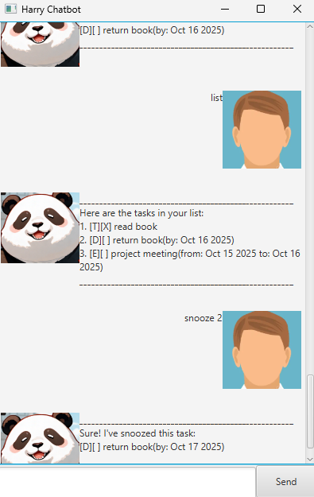

# Harry Chatbot User Guide

```
 _    _
| |  | |                  @
| |__| | ____ ____ ____   _
|  __  |/ _  |  __|  __| | |
| |  | | (_| | |  | |    | |
|_|  |_|\__/_|_|  |_|    |_|
```
## Introduction
Harry Chatbot is a lightweight CLI and GUI-based chatbot designed to help users manage tasks and deadlines efficiently. It allows users to add ToDos, Deadlines, and Events, mark tasks as done or undone, snooze deadlines, and search tasks quickly.



## Adding ToDos

You can create a simple task without a date.

**Action**: Use the todo command followed by a description
Usage Example:
```
todo Read lecture slides
```
Expected Outcome:
```
______________________________________________________
Got it. I've added this task:
[T][ ] Read lecture slides
Now you have 2 tasks in the list.
______________________________________________________
```

## Adding deadlines

You can add a deadline task to keep track of important due dates.

**Action**: Use the deadline command followed by a description and a due date.

Usage Example:
```
deadline Submit assignment /by 2025-09-20
```

Expected Outcome:
```
______________________________________________________
Got it. I've added this task:
[D][ ] Submit assignment (by: Sep 20 2025)
Now you have 1 tasks in the list.
______________________________________________________
```

Notes:

 - The date format must be yyyy-MM-dd.
 - The task will be saved automatically.

## Adding Events

You can add an event that has a start and end date.

**Action**: Use the event command followed by a description, start date, and end date.

Usage Example:
```
event Team meeting /from 2025-09-18 /to 2025-09-18
```

Expected Outcome:
```
______________________________________________________
Got it. I've added this task:
[E][ ] Team meeting (from: Sep 18 2025 to: Sep 18 2025)
Now you have 3 tasks in the list.
______________________________________________________
```

## Listing Tasks

You can see all tasks currently in your list.

**Action**: Use the list command.

Usage Example:
```
list
```
Expected Outcome:
```
______________________________________________________
Here are the tasks in your list:
1. [T][ ] Read lecture slides
2. [D][ ] Submit assignment (by: Sep 20 2025)
3. [E][ ] Team meeting (from: Sep 18 2025 to: Sep 18 2025)
______________________________________________________
```

## Marking & Unmarking Tasks

You can mark a task as completed or undo it.

**Action**: Use mark <index> to mark done and unmark <index> to mark undone.

Usage Example:
```
mark 2
unmark 2
```
Expected Outcome:
```
______________________________________________________
Nice! I've marked this task as done:
[D][X] Submit assignment (by: Sep 20 2025)
______________________________________________________
OK, I've marked this task as not done yet:
[D][ ] Submit assignment (by: Sep 20 2025)
______________________________________________________
```

## Deleting Tasks

You can remove a task from your list.

**Action**: Use the delete command followed by the task index.

Usage Example:
```
delete 1
```
Expected Outcome:
```
______________________________________________________
Noted. I've removed this task:
[T][ ] Read lecture slides
You have 2 tasks remaining.
______________________________________________________
```

## Snoozing Tasks

You can postpone deadlines or events by 1 day.

**Action**: Use the snooze command followed by the task index.

Usage Example:
```
snooze 2
```
Expected Outcome:
```
______________________________________________________
Sure! I've snoozed this task:
[D][ ] Submit assignment (by: Sep 21 2025)
______________________________________________________
```

## Finding Tasks

You can search for tasks containing a keyword.

**Action**: Use the find command followed by a keyword.

Usage Example:
```
find assignment
```

Expected Outcome:
```
______________________________________________________
Here are the tasks in your list: (filtered)
1. [D][ ] Submit assignment (by: Sep 21 2025)
______________________________________________________
```
## Exiting Chatbot

You can exit the chatbot at any time.

**Action**: Use the bye command.

Usage Example:
```
bye
```

Expected Outcome:
```
______________________________________________________
Nice talking to you! I hope to see you again.
______________________________________________________
```